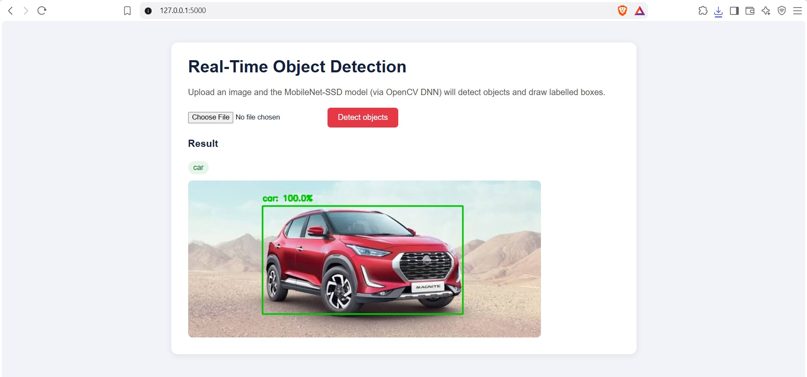
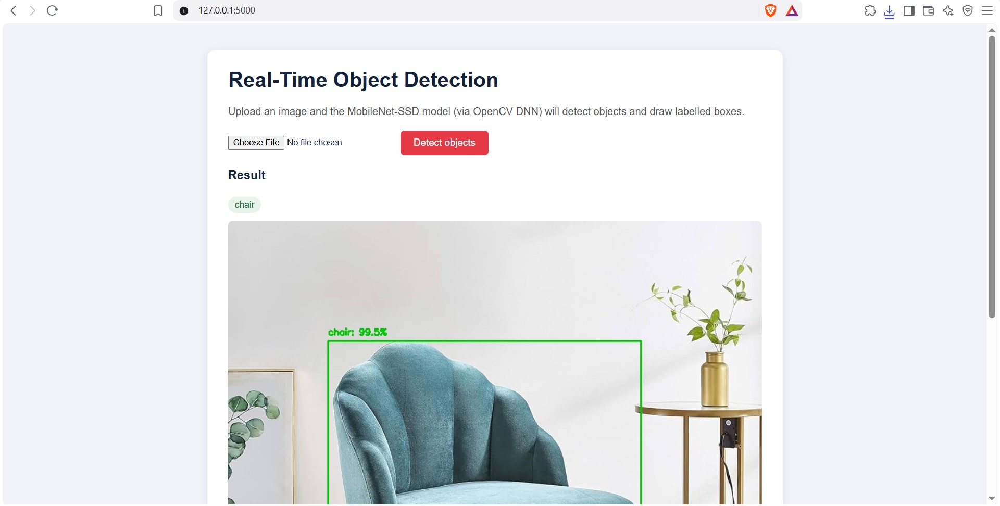
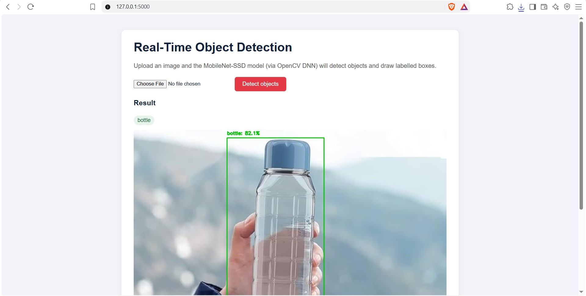

# 🎯 Object Detection using OpenCV DNN

A real-time object detection system that identifies and classifies objects (people, vehicles, animals, and everyday items) in images and live video streams, using a pre-trained **MobileNet-SSD** deep learning model through OpenCV's DNN module.

## Demo

Results from the web dashboard:





## Features

- Detects 20 object classes (person, car, dog, bottle, chair, etc.) with confidence scores
- Web dashboard: upload any image and see bounding boxes drawn around detected objects
- Standalone script for **real-time detection via webcam**
- Lightweight model (MobileNet-SSD) — fast enough to run on a laptop CPU, no GPU required

## Tech Stack

- **Deep Learning:** Pre-trained MobileNet-SSD (Caffe model, loaded via OpenCV's DNN module)
- **Computer Vision:** OpenCV (image processing, bounding box drawing, webcam capture)
- **Backend:** Python, Flask (for the web dashboard)
- **Core concepts:** Convolutional neural networks, object localization, confidence thresholding, real-time video processing

## ⚠️ Required: Download the Model Files First

This project uses a pre-trained model that isn't included in the repo (model weight files are too large for GitHub without Git LFS). Download these two files and place them in the `models/` folder:

1. **`MobileNetSSD_deploy.prototxt`** (the model architecture)
2. **`MobileNetSSD_deploy.caffemodel`** (the trained weights, ~23MB)

From the project folder, run:

```bash
mkdir models
curl -L -o models/MobileNetSSD_deploy.prototxt https://raw.githubusercontent.com/djmv/MobilNet_SSD_opencv/master/MobileNetSSD_deploy.prototxt
curl -L -o models/MobileNetSSD_deploy.caffemodel https://raw.githubusercontent.com/djmv/MobilNet_SSD_opencv/master/MobileNetSSD_deploy.caffemodel
```

The folder should look like this:

```
Real-Time-Object-Detection-OpenCV-Deep-Learning/
├── app.py
├── webcam_detect.py
├── requirements.txt
├── templates/
│   └── index.html
└── models/
    ├── MobileNetSSD_deploy.prototxt
    └── MobileNetSSD_deploy.caffemodel
```

## How It Works

1. An image (uploaded via the web dashboard, or a live webcam frame) is resized and converted into a "blob" — a format the neural network can process.
2. The pre-trained MobileNet-SSD model runs a forward pass on the blob, outputting detected objects, their bounding box coordinates, and confidence scores.
3. Detections above a confidence threshold (40%) are drawn onto the image as labeled bounding boxes.
4. The web app displays the annotated result; the webcam script updates this live, frame by frame.

## Setup & Installation

1. Clone this repository:
```bash
   git clone https://github.com/surjyasaha/Real-Time-Object-Detection-OpenCV-Deep-Learning.git
   cd Real-Time-Object-Detection-OpenCV-Deep-Learning
```

2. Install dependencies:
```bash
   pip install -r requirements.txt
```

3. Download the model files (see instructions above) into the `models/` folder.

4. **For the web dashboard:**
```bash
   python app.py
```
   Then open `http://127.0.0.1:5000` and upload an image.

5. **For real-time webcam detection:**
```bash
   python webcam_detect.py
```
   Press `q` to quit the webcam window.

> On Windows, if `python` isn't recognised, use `py` instead (for example `py app.py`).

## Future Improvements

- Upgrade to a YOLOv8 model for higher accuracy and more object classes
- Add video file upload support (not just live webcam/single images)
- Deploy the web dashboard live (Render/Railway) for a public demo link
- Add object counting and tracking across video frames

## Author

**Surjya Kanta Saha**
B.Tech, Electronics and Communication Engineering
[LinkedIn]([https://linkedin.com/in/surjya-kanta-saha](https://www.linkedin.com/in/surjya-kanta-saha-332071254/?isSelfProfile=true)) | surjyasaaha@gmail.com
